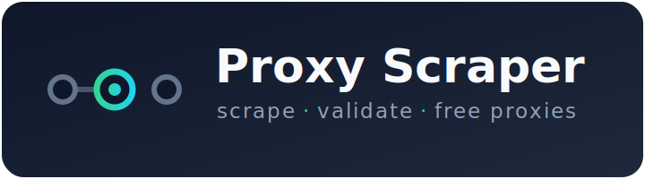

<p align="center">
  
</p>

<p align="center">
  <a href="https://github.com/IlmLV/proxy-scraper/actions/workflows/ci.yml"></a>
  <a href="https://packagist.org/packages/ilmlv/proxy-scraper"></a>
  <a href="https://packagist.org/packages/ilmlv/proxy-scraper/stats"></a>
  <a href="https://packagist.org/packages/ilmlv/proxy-scraper"></a>
  <a href="LICENSE"></a>
</p>

# Proxy Scraper and Validator

Scrape free proxy lists from 36 live, tested sources and individually validate proxy
capabilities — anonymity level, latency, HTTP(S) method support and more. Supports
**http / https / socks4 / socks5** proxies.

> [!WARNING]
> Free public proxies are **highly** not recommended for sensitive data transfer.

## Why this library

- **Batteries included** — 36 proxy sources work out of the box, each parser unit-tested and probed live against its real endpoint in a separate weekly CI job; add your own in a few lines.
- **Cron-aware polling** — each source declares a `SCHEDULE`; `scheduled()` only hits providers that are due.
- **Deep validation** — anonymity (elite / anonymous / exposed), IP country & organisation, per-method latency, request-header leakage and multi-domain reachability.
- **Resilient** — a failing source never aborts the batch; its exception is captured and exposed via `errors()`.
- **Modern & type-safe** — PHP 8.1+, `declare(strict_types=1)`, PSR-4, and a fully mockable Symfony HTTP client.

## Contents

- [Installation](#installation)
- [Usage](#usage)
- [Proxy scraper sources](#proxy-scraper-sources)
- [Proxy validation](#proxy-validation)
- [Testing](#testing)
- [Contributing](#contributing)

## Installation
Recommended installation method is via composer:
```
composer require ilmlv/proxy-scraper
```

## Usage

The snippets below assume Composer's autoloader is already loaded
(`require __DIR__ . '/vendor/autoload.php';`). `dump()` comes from
`symfony/var-dumper` — swap it for `print_r()`/`var_dump()` if you prefer.

### Scrape all sources

```php
use IlmLV\ProxyScraper\LoadProxies;

$proxies = LoadProxies::make()->all();

foreach ($proxies->get() as $proxy) {
    echo $proxy . PHP_EOL;
}

dump($proxies->stats());
```

### Get a deduplicated set

Sources overlap heavily, so the same proxy is often returned by several of them.
`get()` returns every occurrence (and is what `stats()` counts); `unique()` returns
the same proxies flattened across all sources with exact duplicates removed. Two
proxies are equal when their string form (`protocol://[user:pass@]host:port`) matches,
so the same endpoint reached over a different protocol is kept.

```php
use IlmLV\ProxyScraper\LoadProxies;

$proxies = LoadProxies::make()->all();

foreach ($proxies->unique() as $proxy) {
    echo $proxy . PHP_EOL;
}
```

### Scrape a single source

```php
use IlmLV\ProxyScraper\LoadProxies;
use IlmLV\ProxyScraper\Sources\FreeProxyListNet;

$proxies = LoadProxies::make()->only(FreeProxyListNet::class);

foreach ($proxies->get() as $proxy) {
    echo $proxy . PHP_EOL;
}
```

### Scrape only sources that are due

Each source declares a cron `SCHEDULE`; `scheduled()` runs just the ones due
right now — handy for a frequently-polling cron job that should not hammer every
provider on every tick.

```php
use IlmLV\ProxyScraper\LoadProxies;

$proxies = LoadProxies::make()->scheduled();

foreach ($proxies->get() as $proxy) {
    echo $proxy . PHP_EOL;
}
```

### Inspect per-source statistics

```php
use IlmLV\ProxyScraper\LoadProxies;

$proxies = LoadProxies::make()->all();

foreach ($proxies->stats() as $source => $results) {
    echo $source . ' => ' . json_encode($results) . PHP_EOL;
}
```

### Configure a source

Extra config keys are appended to the source URL as query parameters, so you can
tune sources that accept them (e.g. pubproxy.com). You can also supply your own
Symfony HTTP client.

```php
use IlmLV\ProxyScraper\LoadProxies;
use IlmLV\ProxyScraper\Sources\PubProxyCom;
use Symfony\Component\HttpClient\HttpClient;

$scraperConfig = [
    PubProxyCom::class => [
        // 'api'  => 'xxx',
        'country' => 'US',
        'https'   => true,
        'level'   => 'elite',
    ],
];

$httpClient = HttpClient::create(['timeout' => 30]);

$proxies = LoadProxies::make($scraperConfig, $httpClient)
    ->only(PubProxyCom::class);

dump($proxies->stats());
```

### Handle scraper errors

A source that fails (network error, bad response, misconfiguration) does not
throw — the exception is captured and exposed via `errors()`, keyed by the source
class.

```php
use IlmLV\ProxyScraper\LoadProxies;
use IlmLV\ProxyScraper\Sources\PubProxyCom;

$scraperConfig = [
    PubProxyCom::class => [
        'api'            => 'wrong_key',
        'level'          => 'wrong_level',
        'wrongParameter' => 'wrong_value',
    ],
];

$proxies = LoadProxies::make($scraperConfig)->only(PubProxyCom::class);

foreach ($proxies->errors() as $scraper => $exception) {
    echo $scraper . ' => ' . $exception->getMessage() . PHP_EOL;
}
```

## Proxy scraper sources
Currently implemented proxy sources:
- [ALIILAPRO/Proxy](https://github.com/ALIILAPRO/Proxy) (http/socks4/socks5)
- [Bes-js/public-proxy-list](https://github.com/Bes-js/public-proxy-list) (http/socks4/socks5)
- [blogspotproxy.blogspot.com](https://blogspotproxy.blogspot.com/)
- [checkerproxy.net](https://checkerproxy.net)
- [clarketm/proxy-list](https://github.com/clarketm/proxy-list/blob/master/proxy-list.txt)
- [ErcinDedeoglu/proxies](https://github.com/ErcinDedeoglu/proxies) (http/socks4/socks5)
- [free-proxy-list.net](https://www.free-proxy-list.net)
- [free-proxy-list.net/anonymous-proxy.html](https://free-proxy-list.net/anonymous-proxy.html)
- [free-proxy-list.net/uk-proxy.html](https://free-proxy-list.net/uk-proxy.html)
- [freeproxy.world](https://www.freeproxy.world/) (http/https/socks4/socks5)
- [geonode.com](https://geonode.com/free-proxy-list) (http/https/socks4/socks5)
- [hookzof/socks5_list](https://github.com/hookzof/socks5_list) (socks5)
- [hproxy-com/free-proxy-list](https://github.com/hproxy-com/free-proxy-list) (http/https/socks4/socks5)
- [mmpx12/proxy-list](https://github.com/mmpx12/proxy-list) (http/socks4/socks5)
- [monosans/proxy-list](https://github.com/monosans/proxy-list) (http)
- [openproxylist.xyz](https://api.openproxylist.xyz/) (http/socks4/socks5)
- [proxifly/free-proxy-list](https://github.com/proxifly/free-proxy-list) (http/https/socks4/socks5)
- [proxy11.com](http://proxy11.com/free-proxy) (http)
- [proxylistplus.com](https://list.proxylistplus.com/Fresh-HTTP-Proxy-List-1) (http)
- [proxyscrape.com](https://proxyscrape.com/free-proxy-list) (http/socks4/socks5)
- [pubproxy.com](http://pubproxy.com/)
- [r00tee/Proxy-List](https://github.com/r00tee/Proxy-List) (https/socks4/socks5)
- [rdavydov/proxy-list](https://github.com/rdavydov/proxy-list) (http/socks4/socks5)
- [roosterkid/openproxylist](https://github.com/roosterkid/openproxylist) (https/socks4/socks5)
- [SevenworksDev/proxy-list](https://github.com/SevenworksDev/proxy-list) (http/https/socks4/socks5)
- [ShiftyTR/Proxy-List](https://github.com/ShiftyTR/Proxy-List) (http/https/socks4/socks5)
- [socks-proxy.net](https://www.socks-proxy.net)
- [SoliSpirit/proxy-list](https://github.com/SoliSpirit/proxy-list) (http/https/socks4/socks5)
- [spys.me](https://spys.me/proxy.txt) (http)
- [sslproxies.org](https://www.sslproxies.org)
- [TheSpeedX/PROXY-List](https://github.com/TheSpeedX/PROXY-List) (http/socks4/socks5)
- [themiralay/Proxy-List-World](https://github.com/themiralay/Proxy-List-World) (http)
- [us-proxy.org](https://www.us-proxy.org)
- [vakhov/fresh-proxy-list](https://github.com/vakhov/fresh-proxy-list) (http/https/socks4/socks5)
- [VPSLabCloud/VPSLab-Free-Proxy-List](https://github.com/VPSLabCloud/VPSLab-Free-Proxy-List) (http/socks4/socks5)
- [Zaeem20/FREE_PROXIES_LIST](https://github.com/Zaeem20/FREE_PROXIES_LIST) (http/https/socks4/socks5)

Feel free to request more sources.

### Proxy scrapers
Keep in mind that there is prepared multiple types of scraping libraries that can be used to simplify creation of your own source scrapers.
Currently supported source data types:
- [JSON list scraper](https://github.com/IlmLV/proxy-scraper/blob/master/src/Scrapers/JsonListScraper.php)
- [JSON object scraper](https://github.com/IlmLV/proxy-scraper/blob/master/src/Scrapers/JsonScraper.php)
- [Table list scraper](https://github.com/IlmLV/proxy-scraper/blob/master/src/Scrapers/TableListScraper.php)
- [Plain Text list scraper](https://github.com/IlmLV/proxy-scraper/blob/master/src/Scrapers/TextListScraper.php)

Each of these accepts a `$protocols` map (`['http' => $urlA, 'socks5' => $urlB, …]`)
when a provider publishes one endpoint per protocol: every URL is fetched and parsed
with its key as the forced protocol, and a dead endpoint is skipped rather than aborting
the source. Leave it empty to use the single `$url`.

### Define a custom source

Extend one of the scraper base types (each already implements `ScraperInterface`
via `ProxyScraper`), point `$url` at the resource, and hand the class to
`only()`/`add()` — there is no need to register it in `LoadProxies`:

```php
use IlmLV\ProxyScraper\LoadProxies;
use IlmLV\ProxyScraper\Scrapers\JsonScraper;

class CustomGimmeProxy extends JsonScraper
{
    protected string $url = 'https://gimmeproxy.com/api/getProxy';
}

$proxies = LoadProxies::make()->only(CustomGimmeProxy::class);

foreach ($proxies->get() as $proxy) {
    echo $proxy . PHP_EOL;
}
```

Bundled sources live in `src/Sources/`, one class per provider, named
`<Provider>[Variant]` after the provider's identity — its domain or GitHub
owner/repo (e.g. `FreeProxyListNet`, `ShiftyTR`), with a `Variant` suffix only when
one provider exposes several distinct lists (e.g. `FreeProxyListNetUkProxy`). A source
sets `$url` (or a `$protocols` map for a provider publishing one list per protocol), an
optional `$protocol`, the format-specific knobs of its scraper base (see each
`Scrapers/*` class docblock), and a `SCHEDULE`. Unlike a custom source, a bundled one is
registered in `LoadProxies::$scrapers` so it runs under `all()`/`scheduled()`.

## Proxy validation
This library can also be used for proxy capability validation:
- ***anonymity level***: 
  - elite (no origin IP exposure and no proxy relates headers), 
  - anonymous (has proxy related headers), 
  - exposed (has origin IP exposure)
- if proxy ***server IP*** matches server by whom request is performed
- ***HTTP*** support — **forward** proxying (`http`) and a separate **CONNECT-tunnel to :80** check (`httpTunnel`; how chained proxies / forward-proxy gateways reach an exit — run for HTTP proxies only, since SOCKS always tunnel)
- ***HTTPS*** request support (CONNECT tunnel to :443) — `https` requires a **valid certificate** (peer chain + hostname). On failure, `httpsInsecure` retries with verification disabled; a pass there means the proxy tunnels TLS behind an untrusted certificate
- various ***request methods***: GET, POST, PUT, OPTIONS, HEAD, DELETE, PATCH
- huge amount of ***request headers*** if they are not modified by proxy - tested in each request method
- optional ***domain*** reachability checks — opt-in, none run by default; ships with `example.com` as a reference you extend (see [Custom domain validators](#custom-domain-validators))
- ***IP version*** egress capability — whether the proxy can route traffic to IPv4-only and/or IPv6-only destinations.
- average ***latency*** calculation

### Validate a proxy

`ProxyValidation` accepts either a proxy string or a `Proxy` entity. Build it with
`make()`, apply any optional configuration through the `set*()` methods
(`setDomainValidators()`, …), then call `run()` to execute the checks; `run()`
populates and returns the validation object. Construction itself performs no I/O.

```php
use IlmLV\ProxyScraper\Validations\ProxyValidation;

$validation = ProxyValidation::make('http://1.1.1.1:80')->run();

dump($validation);
```

`run()` returns the populated `ProxyValidation`; read each capability off its properties:

| Property | Type | Meaning |
| --- | --- | --- |
| `valid` | `bool` | Overall validity (`false` if a check threw — see `error`). |
| `error` | `?ResponseError` | Set when the run aborted. |
| `anonymityLevel` | `?string` | `elite` / `anonymous` / `exposed`. |
| `ip` | `?IpValidation` | Whether the egress IP matches the proxy host, plus its country / organisation. |
| `http` | `?MethodsValidation` | **Forward** HTTP support (absolute-form requests). For a SOCKS proxy this is its tunnel — SOCKS has no forward mode. |
| `httpTunnel` | `?MethodsValidation` | **CONNECT-tunnel-to-:80** support — how a chained proxy / forward-proxy gateway reaches the exit. Run for HTTP proxies only (SOCKS are already covered by `http`); `null` otherwise. |
| `https` | `?MethodsValidation` | HTTPS support with **certificate verification** (CONNECT tunnel to :443). Fails on an expired, self-signed, hostname-mismatched, or intercepted cert. |
| `httpsInsecure` | `?MethodsValidation` | The same probe with verification **disabled**, run only when `https` fails. Passing means the proxy tunnels TLS behind an untrusted cert; `null` when `https` passed. |
| `domains` | `?DomainsValidation` | Opt-in per-domain reachability (see below). |
| `ipVersion` | `?IpVersionValidation` | IPv4 / IPv6 egress capability. |
| `validatedAt` | `DateTimeInterface` | When the run executed. |

Each `MethodsValidation` exposes a per-method result plus an average `latency`:

```php
$validation->http->get->valid;          // forward GET worked
$validation->httpTunnel?->post->valid;  // CONNECT-tunnel POST worked (null for SOCKS)
$validation->https->latency;            // average HTTPS latency (seconds)
```

### Custom domain validators

Domain reachability checks are **opt-in** — none run unless you ask for them.
A validator extends `AbstractDomainValidation` and only declares what is specific
to it: the domain `NAME` (used as the result key), the `URL` to request (and an
optional non-`GET` `METHOD`), plus a `validate()` that decides whether the
response is what the site should return. The bundled `ExampleCom` is the template:

```php
namespace IlmLV\ProxyScraper\Validations\Domains;

use IlmLV\ProxyScraper\Entities\ResponseError;
use Symfony\Component\DomCrawler\Crawler as Dom;

class ExampleCom extends AbstractDomainValidation
{
    const NAME = 'example.com';   // result key, e.g. $validation->domains->{'example.com'}
    const URL = 'http://example.com/';

    public function validate(): bool
    {
        try {
            $response = $this->request($this->method, $this->url);
            $title = (new Dom($response->getContent()))->filter('title');

            return $response->getStatusCode() === 200
                && $title->text() === 'Example Domain';
        }
        catch (\Throwable $e) {
            $this->error = new ResponseError($e);
            return false;
        }
    }
}
```

Register the validator classes you want to run with `setDomainValidators()`:

```php
use IlmLV\ProxyScraper\Validations\Domains\ExampleCom;
use IlmLV\ProxyScraper\Validations\ProxyValidation;

$validation = ProxyValidation::make('http://1.1.1.1:80')
    ->setDomainValidators([
        ExampleCom::class,
        MyShop::class,   // your own validator extending AbstractDomainValidation
    ])
    ->run();

$validation->domains->{'example.com'}->valid;   // bool
```

### Scrape and validate

Validate every proxy a source returns:

```php
use IlmLV\ProxyScraper\LoadProxies;
use IlmLV\ProxyScraper\Sources\FreeProxyListNet;
use IlmLV\ProxyScraper\Validations\ProxyValidation;

$proxies = LoadProxies::make()->only(FreeProxyListNet::class);

foreach ($proxies->get() as $proxy) {
    $validation = ProxyValidation::make($proxy)->run();

    dump(json_decode(json_encode($validation)));
}
```

The validation result looks like (the `domains` block lists only the validators
you opted into — it is empty when none are configured). Every individual check
also carries an `error` field — `null` when it succeeded, a `{message, file,
line}` object when it failed (`line` is an integer):

```json
{
  "valid": true,
  "anonymityLevel": "elite",
  "ip": {
    "valid": true,
    "countryIsoCode": "NL",
    "organisation": "NForce Entertainment B.V."
  },
  "http": {
    "latency": 0.54314708709717,
    "get": {
      "valid": true,
      "latency": 0.19053816795349,
      "headers": {
        "A-IM": true,
        "Accept": true,
        "Accept-Charset": true,
        "Accept-Encoding": true,
        "Accept-Language": true,
        "Accept-Datetime": true,
        "Access-Control-Request-Method": true,
        "Access-Control-Request-Headers": true,
        "Authorization": true,
        "Cache-Control": true,
        "Connection": true,
        "Cookie": true,
        "Date": true,
        "Expect": true,
        "Forwarded": true,
        "From": true,
        "If-Modified-Since": true,
        "If-None-Match": true,
        "If-Range": true,
        "Max-Forwards": true,
        "Origin": true,
        "Pragma": true,
        "Range": true,
        "Referer": true,
        "TE": true,
        "User-Agent": true,
        "Upgrade": true,
        "Via": true,
        "Warning": true,
        "DNT": true,
        "X-Requested-With": true,
        "X-CSRF-Token": true,
        "X-Real-Ip": true,
        "X-Proxy-Id": true,
        "X-Forwarded": true,
        "X-Forwarded-For": true,
        "Forwarded-For": true,
        "Forwarded-For-Ip": true,
        "Client-Ip": true,
        "X-Client-Ip": true
      }
    },
    "post": {
      "valid": false,
      "latency": null,
      "error": {
        "type": "Symfony\\Component\\HttpClient\\Exception\\TransportException",
        "message": "Connection to proxy closed for \"http://whoami.serviss.it/?format=json\".",
        "file": "/proxy-scraper/vendor/symfony/http-client/Chunk/ErrorChunk.php",
        "line": 56
      },
      "headers": {}
    },
    "put": {
      "valid": true,
      "latency": 2.1179740428925,
      "headers": {...}
    },
    "options": {
      "valid": true,
      "latency": 1.0257298946381,
      "headers": {...}
    },
    "head": {
      "valid": true,
      "latency": 1.9323780536652,
      "headers": {...}
    },
    "delete": {
      "valid": true,
      "latency": 0.52144622802734,
      "headers": {...}
    },
    "patch": {
      "valid": true,
      "latency": 0.42012906074524,
      "headers": {...}
    }
  },
  "https": {
    "latency": 0.54314708709717,
    "get": {
      "valid": true,
      "latency": 0.19053816795349,
      "headers": {...}
    },
    "post": {
      "valid": false,
      "latency": null,
      "error": {
        "type": "Symfony\\Component\\HttpClient\\Exception\\TransportException",
        "message": "Connection to proxy closed for \"https://whoami.serviss.it/?format=json\".",
        "file": "/proxy-scraper/vendor/symfony/http-client/Chunk/ErrorChunk.php",
        "line": 56
      },
      "headers": []
    },
    "put": {
      "valid": true,
      "latency": 2.1179740428925,
      "headers": {...}
    },
    "options": {
      "valid": true,
      "latency": 1.0257298946381,
      "headers": {...}
    },
    "head": {
      "valid": true,
      "latency": 1.9323780536652,
      "headers": {...}
    },
    "delete": {
      "valid": true,
      "latency": 0.52144622802734,
      "headers": {...}
    },
    "patch": {
      "valid": true,
      "latency": 0.42012906074524,
      "headers": {...}
    }
  },
  "httpsInsecure": null,
  "domains": {
    "example.com": {
      "valid": true,
      "latency": 0.4618821144104
    }
  },
  "ipVersion": {
    "ipv4": {
      "valid": true,
      "latency": 0.31204795837402,
      "ip": "203.0.113.4"
    },
    "ipv6": {
      "valid": false,
      "latency": null,
      "ip": null
    }
  },
  "validatedAt": {
    "date": "2022-12-12 23:09:03.938495",
    "timezone_type": 3,
    "timezone": "Europe/Riga"
  }
}

```

## Testing
The library ships with a PHPUnit test suite split into two suites:

- **unit** — fully offline and deterministic. Every HTTP call is mocked with
  Symfony's `MockHttpClient`, so the entities, scraper base classes, all proxy
  sources and the validation subsystem are tested without touching the network.
- **live** — hits the real provider endpoints and asserts each source is still
  reachable and returns proxies. It doubles as a dead-provider monitor and is
  kept out of the gating pipeline.

```bash
composer install

composer test            # unit suite (offline)
composer test:coverage   # unit suite + text coverage report (needs pcov or xdebug)
composer test:live       # live suite (requires network)
composer analyse         # PHPStan static analysis (level 10, offline)
```

Continuous integration runs on GitHub Actions (see `.github/workflows/ci.yml`): the
unit suite runs across PHP 8.1–8.5 with code-coverage reporting, PHPStan static
analysis runs as a separate gating job, and the live suite runs as a separate,
non-blocking job on a weekly schedule (and on demand) so dead or drifting providers
are caught early.

## TODO:
- ~~Add capability to add custom domain validations~~ ✅
- Reduce dependencies
- Improve documentation
- Tighten argument strict conditions
- Add more proxy sources
- ~~Create functional tests~~ ✅
- ~~Monitor test coverage~~ ✅
- Expand PHP compatibility (CI now covers PHP 8.1–8.5)
